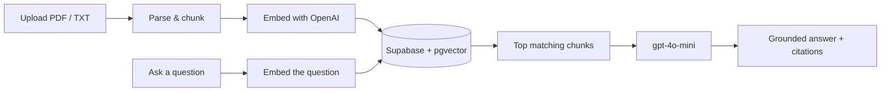

<div align="center">

# Docent AI

**Ask questions about your documents. Get answers that stay on the page.**

Upload a PDF or text file, then chat with it in plain English. Every answer is grounded in the uploaded content, cited back to the source, and honest when the document doesn’t contain the answer.

[](https://www.python.org/)
[](https://fastapi.tiangolo.com/)
[](https://nextjs.org/)
[](https://openai.com/)
[](https://supabase.com/)
[](LICENSE)

<br />

[Features](#features) · [How it works](#how-it-works) · [Setup](#setup) · [API](#api-endpoints)

</div>

---

## Features

<table>
<tr>
<td width="50%" valign="top">

**Document upload**

Drag and drop a PDF or TXT file (up to 10MB). It is chunked, embedded, and indexed automatically.

</td>
<td width="50%" valign="top">

**Grounded answers**

Responses come only from retrieved document content. If the answer isn’t there, Docent says so instead of guessing.

</td>
</tr>
<tr>
<td width="50%" valign="top">

**Source citations**

Every answer names the file it came from, so you can verify the claim against the original document.

</td>
<td width="50%" valign="top">

**Per-document conversations**

Each indexed file has its own chat thread and search scope. Answers never mix content across files.

</td>
</tr>
<tr>
<td width="50%" valign="top">

**Document management**

Browse indexed files with chunk counts and upload dates. Delete any document — and its vectors — at any time.

</td>
<td width="50%" valign="top">

**Clean, responsive UI**

Light and dark mode, built for desktop and mobile.

</td>
</tr>
</table>

---

## How it works



1. **Ingestion** — files are parsed, split into overlapping ~500-token chunks, and embedded with OpenAI `text-embedding-3-small`
2. **Storage** — chunks and embeddings live in Postgres via [pgvector](https://github.com/pgvector/pgvector), hosted on [Supabase](https://supabase.com)
3. **Retrieval** — the question is embedded and matched against that document’s chunks using cosine similarity
4. **Generation** — the top matches go to `gpt-4o-mini` with instructions to answer only from that context, or say clearly when it isn’t there

---

## Tech stack

| Layer | Tools |
| --- | --- |
| **Backend** | Python, FastAPI, OpenAI API |
| **Frontend** | Next.js, TypeScript, Tailwind CSS, Framer Motion |
| **Database** | Supabase (Postgres + pgvector) |

---

## Project structure

```
docent-ai/
├── main.py              FastAPI app — /ask, /upload, /documents
├── pipeline.py          Shared ingestion: extract → chunk → embed → store
├── ingest.py            CLI ingestion script
├── requirements.txt
├── web/                 Next.js frontend
│   └── app/page.tsx
└── README.md
```

---

## Setup

### 1. Database

Create a [Supabase](https://supabase.com) project, then run `schema.sql` in the SQL Editor. That enables the `pgvector` extension and creates the `documents` table plus the `match_documents()` search function.

### 2. Backend

```bash
python3 -m venv venv
source venv/bin/activate
pip install -r requirements.txt
```

Create a `.env` file in the project root:

```env
SUPABASE_URL=your_supabase_url
SUPABASE_KEY=your_supabase_key
OPENAI_API_KEY=your_openai_api_key
```

Then start the API:

```bash
uvicorn main:app --reload --port 8000
```

### 3. Frontend

```bash
cd web
npm install
npm run dev
```

Open [http://localhost:3000](http://localhost:3000).

> You can also ingest files from the command line:
> `python ingest.py path/to/file.pdf`

---

## API endpoints

| Method | Endpoint | Description |
| --- | --- | --- |
| `GET` | `/` | Health check |
| `POST` | `/upload` | Upload and index a PDF or TXT document |
| `GET` | `/documents` | List all indexed documents |
| `DELETE` | `/documents/{source}` | Delete a document and its indexed data |
| `POST` | `/ask` | Ask a question, optionally scoped to one document |

---

## Notes

Retrieval uses fixed top-k search rather than a similarity threshold. Raw cosine scores from `text-embedding-3-small` don’t have a stable cutoff across queries, so the language model itself judges whether the retrieved context answers the question — and reports when it doesn’t.

---

<div align="center">

MIT License · [Muhammad Huzaifa](https://github.com/huzaifadev57)

</div>
